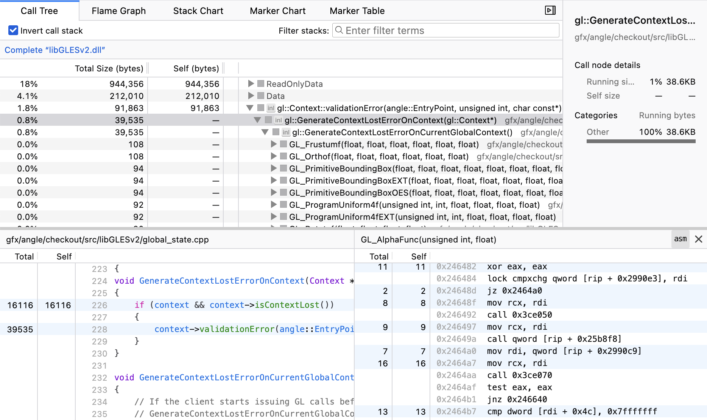

# binary-size-profiler

[](https://share.firefox.dev/4dVmm03)

This tool takes a binary and its debug info, and generates a binary size profile.

Example profile: https://share.firefox.dev/3SJx8gs

```
# Usage:
cargo run --release -- /path/to/binary
samply load output.json
```

This opens the generated profile in https://profiler.firefox.com/.

[Install samply as described in its readme.](https://github.com/mstange/samply?tab=readme-ov-file#installation) `samply` is needed for the source view and the assembly view to show your local files.

The profile linked above took 5 seconds to generate on an M1 Max, for a 5.2MB binary with a 16MB breakpad symbol file. The output was a 73.3MB `output.json` file (9MB gzipped).

## Usage with Rust

Debug information is required for useful output. When you use the binary size profiler on a Rust project, compile your project with `cargo build --profile profiling` and declare a system-wide cargo profile with the name `profiling` in `~/.cargo/config.toml`:

```toml
[profile.profiling]
inherits = "release"
debug = true
```

Then run this tool on `your-rust-project/target/profiling/your-binary`.

## Features

The profile shows information about inlined functions. This means that, in addition to seeing which "outer" functions take the most space, you can see *which inlined calls within each outer function* take up how much space. This lets you find functions which contribute a lot of binary size by being inlined into lots of different places.

The profile also shows the number of instruction bytes per line of source code.
You can see this in the source view, which opens when you double-click a function in the call tree.

You can also see the assembly code of the double-clicked function. There's one caveat: If you open the assembly view for a function which has multiple monomorphized versions with the same name, the assembly view picks one arbitrary monomorphization. Follow [PR #5349](https://github.com/firefox-devtools/profiler/pull/5349) for updates on the ability to see all monomorphizations.

The source view and assembly view only work locally, before the profile is uploaded. The shared profile does not contain source code or assembly code. Follow [issue #4018](https://github.com/firefox-devtools/profiler/issues/4018) for updates on this.

## How does it work?

The current implementation uses a brute force approach.

We walk the bytes in the binary one by one, from front to back. For every byte in a text section, we feed the address into addr2line and look at the file + line + inline stack for that address. If the information is different than for the previous address, we emit a sample, with the sample's "weight" being the byte count for the emitted sample.

## Known issues

- Hardcoded to the Mozilla symbol server: When looking up debug information, this tool makes a request to symbols.mozilla.org with the binary name and its debug ID. This makes for a nice experience when you run this tool on official Firefox binaries, but it's not very useful for other consumers of this tool.
- Output size: For large binaries, the output JSON can be prohibitively large. For example, this tool cannot handle `xul.dll` from Firefox, which is 162MB big. It creates over 3GB of JSON, which is too much for the front-end.
- Confusing byte counts in the assembly view: To save space in the profile JSON, we don't write down the byte count for every instruction. We only emit a new sample for an instruction address if the function + source information about that address is different from the information for the previous byte. This often makes it look as if one instruction took 20 bytes and the next four instructions took zero bytes each. You need to imagine the 20 bytes being "spread out" over the whole hunk of instructions until the next sample count.
- Incomplete attribution for some bytes: For example, on macOS, we don't break down usage by mach-O segment, only by mach-O section. This means that symbol tables are currently attributed to the "root" node of the binary rather than to the `__LINKEDIT` segment. There are lots of improvements we could make to add more fine-grained information.

## License

Licensed under either of

  * Apache License, Version 2.0 ([`LICENSE-APACHE`](./LICENSE-APACHE) or http://www.apache.org/licenses/LICENSE-2.0)
  * MIT license ([`LICENSE-MIT`](./LICENSE-MIT) or http://opensource.org/licenses/MIT)

at your option.

Unless you explicitly state otherwise, any contribution intentionally submitted
for inclusion in the work by you, as defined in the Apache-2.0 license, shall be
dual licensed as above, without any additional terms or conditions.
